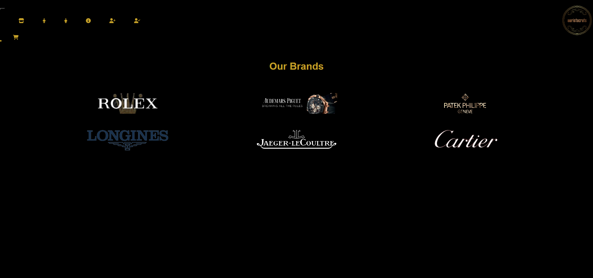

# Awristocrats

## Description

 The philosophy at Awristocrats is that a watch is not just a timekeeping device; it's a reflection of your unique personality and a symbol of your discerning taste. Their curated collection of exquisite luxury watches is designed to cater to your desire for the finest craftsmanship, precision, and unparalleled beauty.

## Table of Contents
*[Title](#title)

*[Description](#description)
    
*[Installation](#installation)
    
*[Usage](#usage)
    
*[Contributors](#contributor)

*[URL](#URL)
    

## Installation

npm install, seed data, and open in browser

## Usage

The primary purpose of this project is to create an online shopping experience for users interested in luxury watches. It offers a curated collection of high-end timepieces from prestigious watch brands.

## Contributors
- https://github.com/shbunch 
- https://github.com/safwaan41 
- https://github.com/fordefam12

## badges

             

## URL

<a href='https://arcane-caverns-68488-3502f0db0406.herokuapp.com/'>
CLICK QR CODE for deploy link<</a>

## Screenshots

.png>)

